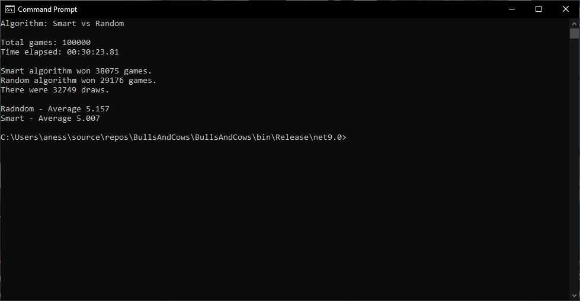

# Bulls and Cows Game and Information Theory
Demonstrate the use of Claude Shannon's Information Theory to improve strategy in the game of Bulls and Cows

**Bulls and cows** (also known as **cows and bulls** or **pigs and bulls**) is a code-breaking or paper-and-pencil game for two or more players. The game is played in turns by two opponents who aim to decipher the other's secret code by trial and error. Here is the Wikipedia [article](https://en.wikipedia.org/wiki/Bulls_and_cows) about the game. 

During my teenage years, I was playing this game with my friend using pencil and paper, and I wanted to create a program to do it. The original algorithm was this:

1. Generate all permutations (9\*8\*7\*6=3024)
2. Select a random number from the list of permutations
3. Receive the feedback (number of bulls and cows)
4. Compare the list of permutations with the selected number and filter out those where the feedback info (number of bulls and cows) does not match.
5. Repeat step 2 until we get the feedback of 4 bulls, meaning we guessed the secret number.

This algorithm is what I call **Random selection**. 

When I learned about the [Theory of Information](https://en.wikipedia.org/wiki/Information_theory#:~:text=Information%20theory%20is%20the%20mathematical%20study%20of%20the,the%20works%20of%20Harry%20Nyquist%20and%20Ralph%20Hartley.) by [Claude Shannon](https://www.britannica.com/biography/Claude-Shannon) and the concept of [entropy](https://www.britannica.com/biography/Claude-Shannon) within the information theory (not to be confused with entropy within the Thearo of Thermodynamics), I realized that Step 2 in the above-mentioned algorithm could be improved. Even though every permutation in our list of possible solutions has an equal probability of being correct, not each of them could bring the same amount of information. Thus, I created another strategy, which I called Maximum Entropy Selection, to select the number with the maximum entropy. 

I ran simulations with one million games for both algorithms, and this is the result:

At first, the difference in the average number of tries to beat the code is not great (dropped from 5.155 to 5.008), the improvement is visible. Also, in 1,500 simulations, it took 8 tries for the Random Selection algorithm to guess the secret code, and in 4 cases it needed 9 tries. On the other hand, the Maximum Entropy Selection algorithm never needed more than 7 tries to guess the code. 

Then I ran 100,000 simulations playing both algorithms against each other and here are the results. 

